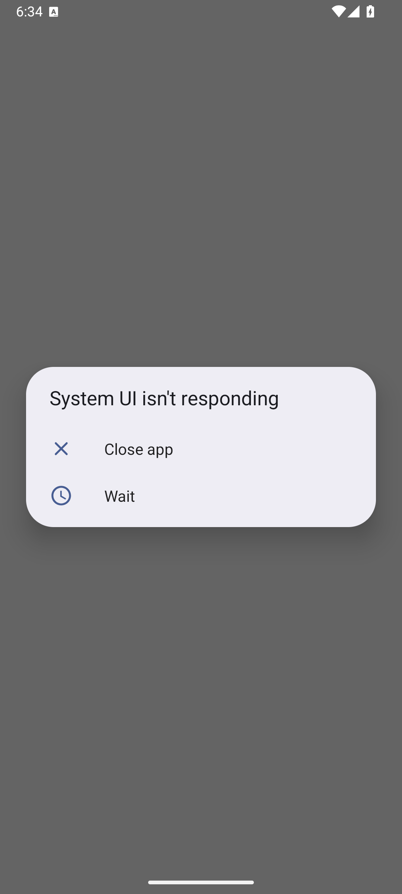
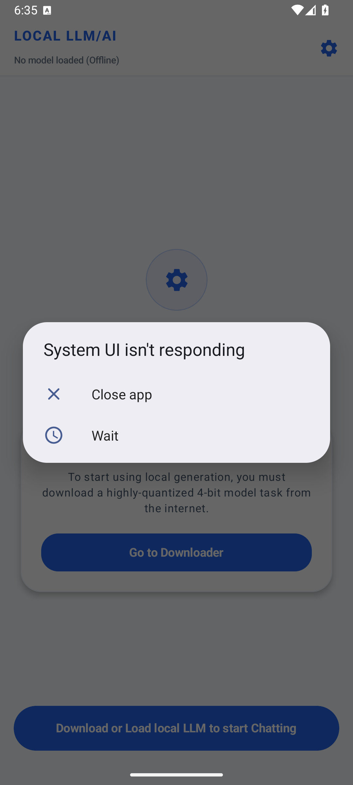

<div align="center">

# Local LLM/AI

### A premium, high-performance offline Android client for running Large Language Models (LLMs) on-device.

<br/>

[](releases/latest)
[](LICENSE)
[](releases)
[](#download)
<br/>

[**Download**](#download) - [**Features**](#features) - [**Screenshots**](#screenshots) - [**Credits**](#credits) - [**Disclaimer**](#disclaimer)

</div>

> [!WARNING]
> Local LLM/AI executes AI models entirely on your physical mobile device. Running large models is highly resource-intensive and requires a modern processor and sufficient RAM (6 GB+). System stability, inference speeds, and output quality depend entirely on your hardware capability.
> Model weights (such as Qwen, DeepSeek, or Gemma) are not packaged inside the APK and must be downloaded or transferred manually due to their size (1.5 GB+).

Additionally, this application executes all calculations offline. No internet connection is required after models are downloaded, and no conversational data ever leaves your device.

---

## What Is Local LLM/AI?

Local LLM/AI is a high-fidelity, modern Android client designed to provide a completely private, offline, and secure conversational AI experience. By integrating Google's optimized **MediaPipe Tasks GenAI** engine, the app compiles and runs lightweight LLMs (like Qwen 2.5, DeepSeek-R1, Phi-2, and Gemma 2B) natively on mobile hardware, leveraging GPU acceleration (Vulkan) for responsive streaming generation.

The app wraps this powerful local engine in a premium, fluid Jetpack Compose (Material 3) user interface with dynamic theme styling and background download handling.

---

## Features

| Inference | Model Manager |
| --- | --- |
| High-performance offline LLM execution | Integrated direct model downloader |
| GPU hardware acceleration (Vulkan) | Presets for Qwen 2.5, DeepSeek-R1, Phi-2 & Gemma |
| Graceful CPU fallback optimization | Support for custom model `.task` URLs |
| Streaming word-by-word responses | Secure local file-system sandbox |

| UI / Experience | Core Features |
| --- | --- |
| Premium Material 3 dynamic styling | Complete offline privacy |
| Custom system instructions prompt | Direct file parsing |
| Smooth, fluid animations | Quantized weights optimizations |
| Copy to clipboard & message actions | Multi-thread worker dispatcher |

---

## Screenshots

<div align="center">


&nbsp;&nbsp;&nbsp;&nbsp;


</div>

---

## Download

Grab the latest APK from the [GitHub releases page](releases/latest). Use a release build for normal installs; debug builds are only for local testing.

---

## Build

```bash
$env:JAVA_HOME = "C:\Users\Badsiwal\.antigravity-ide\extensions\redhat.java-1.54.0-win32-x64\jre\21.0.10-win32-x86_64"
./gradlew assembleDebug
```

---

## Credits

Local LLM/AI is built on top of state-of-the-art on-device intelligence libraries and modern Android components.

Special thanks to:

- [Google MediaPipe Tasks GenAI](https://github.com/google-ai-edge/mediapipe)
- [Jetpack Compose & Material 3](https://developer.android.com/compose)
- [OkHttp](https://github.com/square/okhttp)
- [Kotlin Coroutines Flow](https://github.com/Kotlin/kotlinx.coroutines)

---

## License

Local LLM/AI is licensed under the MIT License. See [LICENSE](LICENSE) for details.

---

## Disclaimer

Local LLM/AI is an independent, unofficial project. It is not affiliated with, funded, authorized, endorsed by, or associated with Google LLC, MediaPipe, Gemma, or any of their affiliates.

All trademarks, service marks, catalogs, artwork, metadata, and model weights remain the property of their respective owners. Users are responsible for procuring and loading model files in compliance with the respective model's terms of use, license agreements, and regional requirements.
