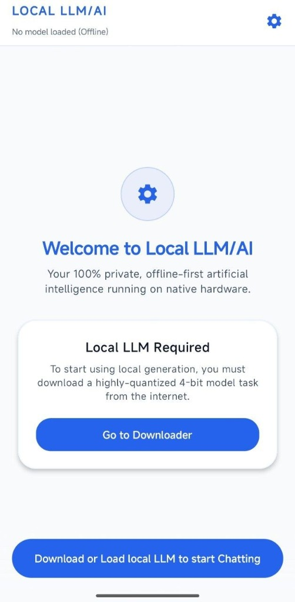
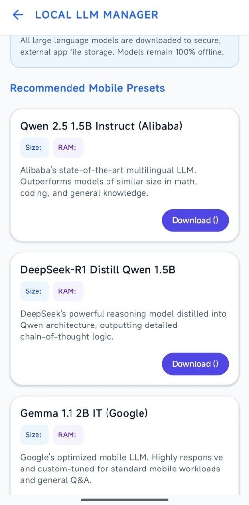

<div align="center">

# Local LLM/AI

### A premium, high-performance offline Android client for running Large Language Models (LLMs) on-device with multimodal OCR.

<br/>

[](https://github.com/PrinceBad/Local-LLM-AI/releases/latest)
[](LICENSE)
[](https://github.com/PrinceBad/Local-LLM-AI/releases/latest/download/app-release.apk)
[](#download)
<br/>

[**Download**](#download) - [**Features**](#features) - [**Screenshots**](#screenshots) - [**Credits**](#credits) - [**Disclaimer**](#disclaimer)

</div>

> [!WARNING]
> Local LLM/AI executes AI models entirely on your physical mobile device. Running large models is highly resource-intensive and requires a modern processor and sufficient RAM (6 GB+). System stability, inference speeds, and output quality depend entirely on your hardware capability.
> Model weights (such as Qwen, DeepSeek, or Gemma) are not packaged inside the APK and must be downloaded or transferred manually due to their size (1.5 GB+).

Additionally, this application executes all calculations offline. No internet connection is required after models are downloaded, and no conversational data ever leaves your device.

---

## What Is Local LLM/AI?

Local LLM/AI is a high-fidelity, modern Android client designed to provide a completely private, offline, and secure conversational AI experience. By integrating Google's optimized **Google AI Edge LiteRT** (formerly MediaPipe Tasks GenAI) engine, the app compiles and runs lightweight LLMs (like DeepSeek-R1, Qwen 2.5, Qwen 3, and Google Gemma 4) natively on mobile hardware. 

The app targets GPU acceleration (Vulkan) for responsive streaming generation with graceful CPU fallback.

> **Performance Note:** Execution speed depends entirely on the model size and your device's hardware. Larger models in .litertlm format (like Qwen 3 4B) will natively generate text slower than smaller .task models (like Qwen 1.5B) due to processing significantly more parameters.

The app wraps this powerful local engine in a premium, fluid Jetpack Compose (Material 3) user interface featuring offline OCR document parsing, video/file media integration, and background download handling.

---

## Supported Models

The app includes built-in presets for several highly-capable, lightweight models optimized for mobile execution. Below are their approximate download sizes and memory requirements:

| Text & Reasoning Models | Multimodal & Coding Models |
| --- | --- |
| **DeepSeek-R1 Distill Qwen 1.5B**<br/>• Parameters: 1.5B \| Size: ~1.7 GB<br/>• Min. RAM: 6 GB+ (Offline Reasoning) | **Qwen 2.5 Coder 3B Instruct**<br/>• Parameters: 3B \| Size: ~2.9 GB<br/>• Min. RAM: 6 GB+ (Coding Expert) |
| **Qwen 2.5 1.5B Instruct**<br/>• Parameters: 1.5B \| Size: ~1.5 GB<br/>• Min. RAM: 6 GB+ (General Knowledge) | **Google Gemma 4 E2B Instruct**<br/>• Parameters: 2B \| Size: ~2.4 GB<br/>• Min. RAM: 6 GB+ (Multimodal Vision) |
| **Qwen 3 4B**<br/>• Parameters: 4B \| Size: ~2.5 GB<br/>• Min. RAM: 8 GB+ (High Performance) | **Google Gemma 4 E4B Instruct**<br/>• Parameters: 4B \| Size: ~3.4 GB<br/>• Min. RAM: 8 GB+ (High-Res Multimodal) |
| **Qwen 2.5 0.5B Instruct**<br/>• Parameters: 0.5B \| Size: ~0.5 GB<br/>• Min. RAM: 4 GB+ (Ultra-Fast) | |

---

## Features

| Inference | Multimodal & OCR (100% Offline) |
| --- | --- |
| High-performance offline LLM execution | Attach Images, Videos & Documents (PDF, Code, Text) |
| Vulkan GPU acceleration with graceful CPU fallback | Offline image OCR text extraction using Google ML Kit |
| Stop Generation button during active streaming | Offline page-by-page PDF rendering and text recognition |
| Streaming word-by-word responses | Playback attached videos natively and view documents via Intent |

| UI / Experience | Core Features |
| --- | --- |
| Premium Material 3 dynamic styling | Complete offline privacy (no logs or tracking) |
| Settings Slider for Context Window (4-12 turns) | Large model memory size & RAM badges in-app |
| Custom system instructions prompt & personas | Chat History Persistence (saves to `chat_history.json`) |
| Interactive file attachments preview drawer | Export/Share Chat transcript via native Android share sheet |
| Gated model downloads with Hugging Face Token | Model package integrity check (ZIP/Flatbuffer verification) |
| Delete confirmation warning dialog | 100% Dark Mode cohesive compliance |

### Recent UI/UX & Quality-of-Life Optimizations (v1.2+)
- **Hugging Face Authentication**: Added dedicated settings screen to securely input, validate, and save your Hugging Face Access Token with automatic S3 redirect auth-header handling.
- **Configurable Context Window**: Added settings slider (4 to 12 turns) to dynamically limit history, saving RAM and improving response speed.
- **System Prompt Guidelines**: Enabled customizing system instructions to guide local AI personas.
- **Post-Download Validation**: Introduced structural file validation after downloads complete to avoid native crashes on corrupted model files.
- **Consolidated Top Header**: Reduced vertical height to 56.dp, center-aligned settings and delete icons, added system status bar padding, and cleaned up loaded model titles.
- **Refined Chat Bubbles**: Applied uniform 16.dp corner radius with a sharp 4.dp anchor corner on the sender's edge, expanded text margins, and integrated high-contrast borders for light and dark themes.
- **Sleek Input & Attachments**: Replaced individual file buttons with a single "+" dropdown trigger, introduced a compact text input area using custom BasicTextField, and implemented state-based styling for the send controls.
- **Seamless Keyboard Handling**: Redesigned layout flow to use sequential vertical Column with .imePadding(), automatically shifting the input bar and triggering auto-scroll to the bottom upon soft keyboard popups without leaving blank gaps.
- **Optimized Compose UI**: Drastically reduced UI rendering overhead and scrolling stutter during LLM streaming generation by maintaining stable chat item identities and intelligently throttling Compose state updates.

---

## Screenshots

<div align="center">


&nbsp;&nbsp;&nbsp;&nbsp;


</div>

---

## Download

Grab the latest compiled APK by clicking the [**Direct Download Link**](https://github.com/PrinceBad/Local-LLM-AI/releases/latest/download/app-release.apk) (or view all versions and release details on the [GitHub releases page](https://github.com/PrinceBad/Local-LLM-AI/releases/latest)).

The release APK (`app-release.apk`) is optimized for mobile hardware using on-device GPU (Vulkan) or CPU.

---

## Build

To compile the application yourself, ensure you have Java 17 and Android SDK set up. Set your JDK path and run the compilation:

### Build Release APK
```powershell
# Set this to your own JDK 17 path
$env:JAVA_HOME = "C:\path\to\your\jdk-17"
./gradlew assembleRelease
./gradlew assembleRelease
```

---

## Credits

Local LLM/AI is built on top of state-of-the-art on-device intelligence libraries and modern Android components.

Special thanks to:

- [Google AI Edge LiteRT](https://ai.google.dev/edge/litert)
- [Google ML Kit Text Recognition](https://developers.google.com/ml-kit/vision/text-recognition)
- [Jetpack Compose & Material 3](https://developer.android.com/compose)
- [Coil Image Loading Library](https://github.com/coil-kt/coil)
- [OkHttp](https://github.com/square/okhttp)
- [Kotlin Coroutines Flow](https://github.com/Kotlin/kotlinx.coroutines)

---

## License

Local LLM/AI is licensed under the MIT License. See [LICENSE](LICENSE) for details.

---

## Disclaimer

Local LLM/AI is an independent, unofficial project. It is not affiliated with, funded, authorized, endorsed by, or associated with Google LLC, MediaPipe, Gemma, or any of their affiliates.

All trademarks, service marks, catalogs, artwork, metadata, and model weights remain the property of their respective owners. Users are responsible for procuring and loading model files in compliance with the respective model's terms of use, license agreements, and regional requirements.

